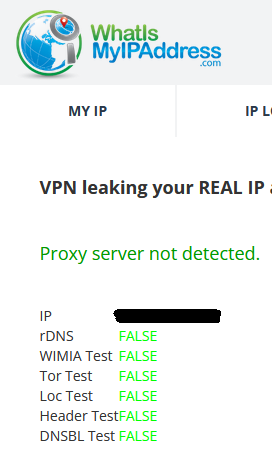
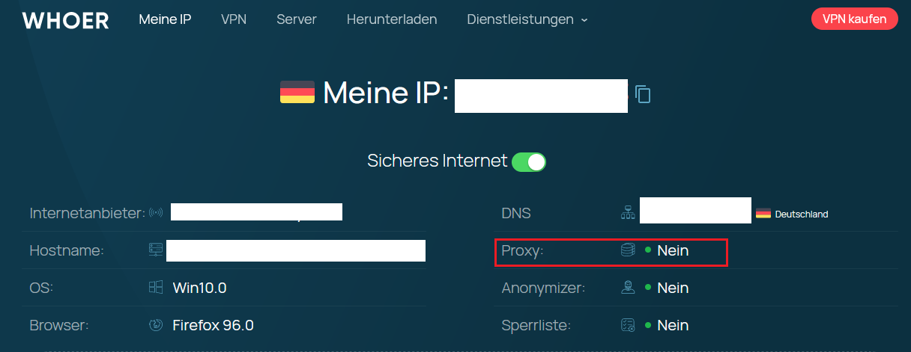

# _netcode_Proxy-UDF
This is an Addon for the _netcode UDF.

This addon requires _netcode_AddonCore.au3
https://github.com/OfficialLambdax/_netcode_AddonCore-UDF

and _netcode_Core.au3
https://github.com/OfficialLambdax/_netcode_Core-UDF

The same describition of the Core UDF applies to here. This UDF is in its concept phase and alot of things are missing and subject to change.

The Proxy UDF is not a specific HTTP/S proxy, it is the proxy that you want it to be. Meaning that you can implement your own methods on
processing a client packets to determine the destination. Generally the UDF should be capable to be compatible with any TCP protocol.

The UDF features a variety of middlemans. One of which is the "Between" middleman where you can intercept the transmitted data to either just view it or to modify it. The UDF wasnt ment to be used as a Man in the middle software, but it is very much possible. Certain protocols may just require that the transmitted packets are manipulated, thats why this feature is implemented.

All sockets are entirely non blocking.

Transmitting 200mbit/s through the proxy just took 2 % of CPU power on my end user computer.
So it might be possible for the proxy to relay 1 Gbit/s or more. I could not test that yet.
But considering that the Proxy UDF is very light weight, it should be possible.

    
    
    

